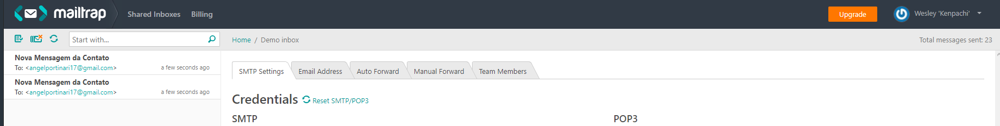

# Requisitos do Sistema

-   Node
-   Npm
-   Composer
-   PHP >= 7

## Instalando dependências do Composer ( Caso necessário )

-   composer install

## Instalando dependências do Npm

-   npm install

## Buildando Aplicação Vue

-   npm run prod

# Arquivos de Configuração

## .Env

Criar uma cópia do arquivo _.env.example_ e renomear para _.env_

## Banco de Dados

-   Criar uma database em qualquer banco de dados suportado pelo Laravel.
-   Adicionar as configurações da conexão e o nome do banco de dados no arquivo _.env_

Campos do banco de dados no _.env_

```
DB_CONNECTION=mysql         // Driver do banco de dados escolhido
DB_HOST=127.0.0.1           // Host
DB_PORT=3306                // Porta onde será servido
DB_DATABASE=homestead       // Nome da base de dados previamente criada
DB_USERNAME=homestead       // usuário do banco
DB_PASSWORD=secret          // senha de usuário
```

Depois de fazer essas configurações de database no .env
rodar o comando **\$ php artisan migrate** no terminal, na pasta raiz do repositório. Pra que as tabelas subam ao banco de dados configurado.

## Configurações de Serviço externo de Email

Escolhi o serviço da mailtrap pra utilizar nesse desafio.

```
MAIL_DRIVER=smtp
MAIL_HOST=smtp.sendgrid.net
MAIL_PORT=587
MAIL_USERNAME=null
MAIL_PASSWORD=null
MAIL_ENCRYPTION=tls
```

No próprio Mailtrap tem as _credentials_ pra serem copiadas e coladas no .env


## Rodando os Testes

Para rodar os testes que preparei pra aplicação apenas digite o comando
**\$ ./vendor/bin/phpunit -v** no terminal, na pasta raiz do repositório.

_BTW_ os testes se encontram no arquivo ContactMessageTest.php dentro de _tests/Feature_

## Subindo o Servidor

Pra subir o servidor localmente, apenas digite o comando **\$ php artisan serve** no terminal, na pasta raiz do repositório.

## Abrindo a Página de Contatos

Após rodar o servidor entrar na url **[http://localhost:8000/contact](http://localhost:8000/contact)**

## Checando Emails

Abra o Mailtrap em sua conta, e abra a sua inbox demo / ou a que vc tiver criado. Lá vai estar o Email. Será algo parecido com isso:





